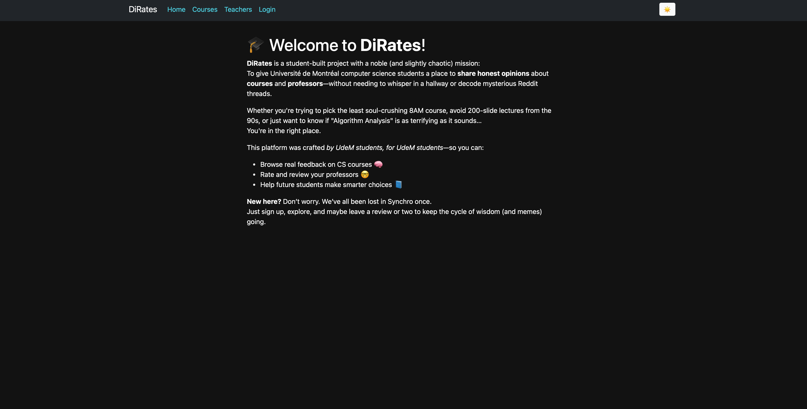

# Dirates

Dirates is a full-stack web app with **Django (backend)** and **React (frontend)** to rate and review UdeM computer science courses.

## 🚀 Launch

```bash
# Clone repo
git clone https://github.com/your-username/dirates.git
cd dirates

# Backend
cd backend/dirates_BE
pip install -r requirements.txt
python manage.py migrate
python manage.py runserver &

# Frontend
cd ../../frontend
npm install
npm start


```
Open http://localhost:3000


